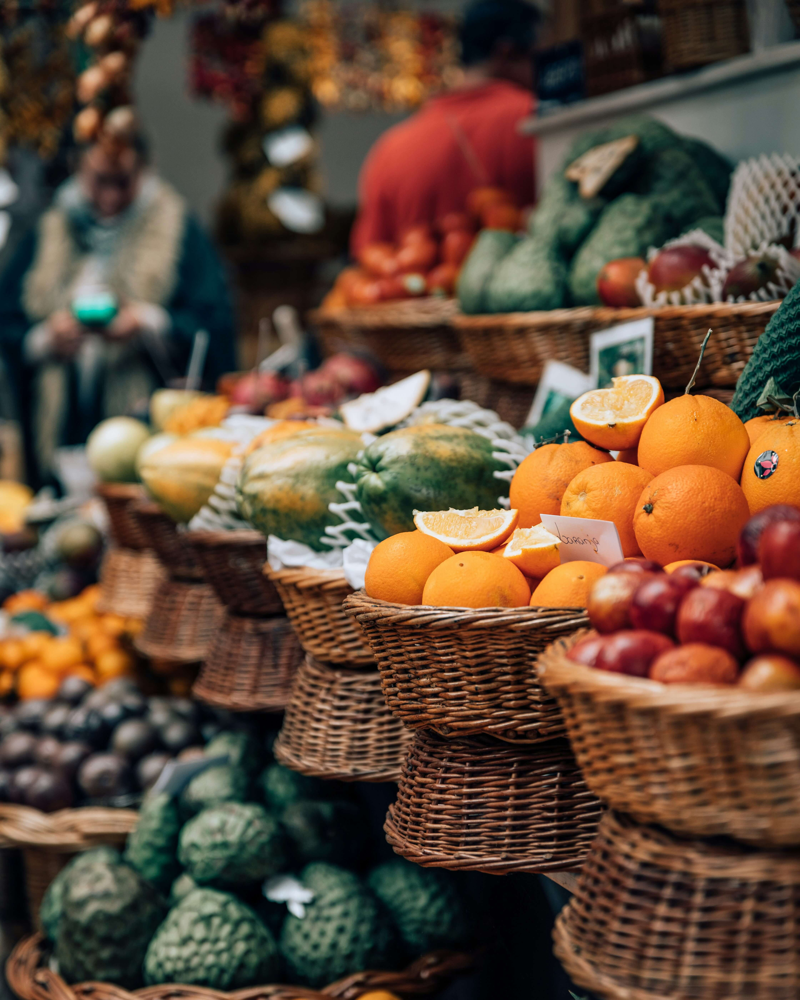

# 🌽 Mercado El Buen Sabor

Sitio web informativo y responsive creado como plantilla para mercados o negocios locales.  
Desarrollado por **Mag Dev** como parte de su portafolio profesional.

---

## 🧾 Características

- Estructura HTML semántica
- Estilos CSS limpios y responsivos
- Menú móvil con JavaScript
- Formulario de contacto (sin backend)
- Favicon personalizado
- Imágenes libres de derechos
- Accesibilidad básica
- Optimizado para SEO

---

## 📷 Vista previa

---

## 🔗 Sitio en vivo

- GitHub Pages: [https://magdevwebsfrontend.github.io/mi-mercado/](https://magdevwebsfrontend.github.io/mi-mercado/)
- Vercel: *(Agregar el enlace después de desplegar)*

---

## 🛠️ Tecnologías

- HTML5
- CSS3
- JavaScript
- [Unsplash](https://unsplash.com/) / [Pexels](https://pexels.com/) para imágenes

---

## 👨‍💻 Desarrollador

**Mag Dev**  
👨‍💻 Estudiante de Ingeniería | Desarrollador Web Junior | Automatización con Python  
📧 magdev.websfrontend@gmail.com  
🌐 [GitHub](https://github.com/MagDevWebsFrontend) | [LinkedIn](https://www.linkedin.com/in/mag-dev-webs-frontend-229683377)

---

## ⚠️ Licencia

Este proyecto es libre de uso con fines educativos o comerciales, pero se agradece atribución.  
Las imágenes usadas provienen de bancos gratuitos y deben ser reemplazadas si el sitio se publica oficialmente.

